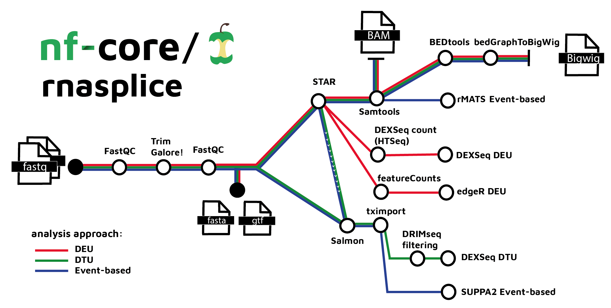

#  

[](https://github.com/nf-core/rnasplice/actions?query=workflow%3A%22nf-core+CI%22)
[](https://github.com/nf-core/rnasplice/actions?query=workflow%3A%22nf-core+linting%22)
[](https://nf-co.re/rnasplice/results)
[](https://doi.org/10.5281/zenodo.XXXXXXX)

[](https://www.nextflow.io/)
[](https://docs.conda.io/en/latest/)
[](https://www.docker.com/)
[](https://sylabs.io/docs/)
[](https://tower.nf/launch?pipeline=https://github.com/nf-core/rnasplice)

[](https://nfcore.slack.com/channels/rnasplice)
[](https://twitter.com/nf_core)
[](https://www.youtube.com/c/nf-core)

## Introduction

<!-- TODO nf-core: Write a 1-2 sentence summary of what data the pipeline is for and what it does -->

**nf-core/rnasplice** is a bioinformatics pipeline for Alternative splicing analysis of RNA sequencing data obtained from organisms with a reference genome and annotation.

On release, automated continuous integration tests run the pipeline on a [full-sized dataset](https://github.com/nf-core/test-datasets/tree/rnaseq#full-test-dataset-origin) obtained from the ENCODE Project Consortium on the AWS cloud infrastructure. This ensures that the pipeline runs on AWS, has sensible resource allocation defaults set to run on real-world datasets, and permits the persistent storage of results to benchmark between pipeline releases and other analysis sources. The results obtained from running the full-sized tests individually for each `--aligner` option can be viewed on the [nf-core website](https://nf-co.re/rnaseq/results) e.g. the results for running the pipeline with `--aligner star_salmon` will be in a folder called `aligner_star_salmon` and so on.

The pipeline is built using [Nextflow](https://www.nextflow.io), a workflow tool to run tasks across multiple compute infrastructures in a very portable manner. It uses Docker/Singularity containers making installation trivial and results highly reproducible. The [Nextflow DSL2](https://www.nextflow.io/docs/latest/dsl2.html) implementation of this pipeline uses one container per process which makes it much easier to maintain and update software dependencies. Where possible, these processes have been submitted to and installed from [nf-core/modules](https://github.com/nf-core/modules) in order to make them available to all nf-core pipelines, and to everyone within the Nextflow community!

<!-- TODO nf-core: Add full-sized test dataset and amend the paragraph below if applicable -->

On release, automated continuous integration tests run the pipeline on a full-sized dataset on the AWS cloud infrastructure. This ensures that the pipeline runs on AWS, has sensible resource allocation defaults set to run on real-world datasets, and permits the persistent storage of results to benchmark between pipeline releases and other analysis sources. The results obtained from the full-sized test can be viewed on the [nf-core website](https://nf-co.re/rnasplice/results).

## Online videos

You can find numerous talks on the [nf-core events page](https://nf-co.re/events) from various topics including writing pipelines/modules in Nextflow DSL2, using nf-core tooling, running nf-core pipelines as well as more generic content like contributing to Github. Please check them out!

## Pipeline summary

<!-- TODO nf-core: Fill in short bullet-pointed list of the default steps in the pipeline -->


1. Merge re-sequenced FastQ files ([`cat`](http://www.linfo.org/cat.html))
2. Read QC ([`FastQC`](https://www.bioinformatics.babraham.ac.uk/projects/fastqc/))
3. Adapter and quality trimming ([`TrimGalore`](https://www.bioinformatics.babraham.ac.uk/projects/trim_galore/))
4. Alignment with [`STAR`](https://github.com/alexdobin/STAR)
5. Choice of quantification depending on analysis type:
   1. [`STAR`](https://github.com/alexdobin/STAR) -> [`Salmon`](https://combine-lab.github.io/salmon/) *DTU*
   2. [`STAR`](https://github.com/alexdobin/STAR) -> [`featureCounts`](https://academic.oup.com/bioinformatics/article/30/7/923/232889?login=false) *DEU edgeR*
   3. [`STAR`](https://github.com/alexdobin/STAR) -> [`HTSeq`](https://htseq.readthedocs.io/en/master/) (DEXSeq count) *DEU DEXSeq*
8. Sort and index alignments ([`SAMtools`](https://sourceforge.net/projects/samtools/files/samtools/))
9. Create bigWig coverage files ([`BEDTools`](https://github.com/arq5x/bedtools2/), [`bedGraphToBigWig`](http://hgdownload.soe.ucsc.edu/admin/exe/))
10. Pseudo-alignment and quantification ([`Salmon`](https://combine-lab.github.io/salmon/); _optional_)
11. Summarize QC ([`MultiQC`](http://multiqc.info/))
12. Differential Exon Usage (DEU):
   1. For differential expression analysis of exons ([`DEXSeq`](https://bioconductor.org/packages/devel/bioc/vignettes/DEXSeq/inst/doc/DEXSeq.html))
   2. Differential expression analysis following quantification with featureCounts ([`edgeR`](https://bioconductor.org/packages/release/bioc/html/edgeR.html))
13. Differential Transcript Usage (DTU):
    1. Filtering of genes and features with low expression ([`DRIMSeq`](https://rdrr.io/bioc/DRIMSeq/man/dmFilter.html))
    2. For differential expression analysis of transcripts ([`DEXSeq`](http://bioconductor.org/packages/release/workflows/vignettes/rnaseqDTU/inst/doc/rnaseqDTU.html))
14. Event-based Differential Splicing analysis:
    1. For detection of differential alternative splicing from replicate RNA-Seq data ([`rMats`](https://github.com/Xinglab/rmats-turbo))
    2. Useing transcript abundances to estimate PSI values for each Differential Splicing event ([`SUPPA`](https://github.com/comprna/SUPPA))

## Quick Start

1. Install [`Nextflow`](https://www.nextflow.io/docs/latest/getstarted.html#installation) (`>=21.10.3`)

2. Install any of [`Docker`](https://docs.docker.com/engine/installation/), [`Singularity`](https://www.sylabs.io/guides/3.0/user-guide/) (you can follow [this tutorial](https://singularity-tutorial.github.io/01-installation/)), [`Podman`](https://podman.io/), [`Shifter`](https://nersc.gitlab.io/development/shifter/how-to-use/) or [`Charliecloud`](https://hpc.github.io/charliecloud/) for full pipeline reproducibility _(you can use [`Conda`](https://conda.io/miniconda.html) both to install Nextflow itself and also to manage software within pipelines. Please only use it within pipelines as a last resort; see [docs](https://nf-co.re/usage/configuration#basic-configuration-profiles))_.

3. Download the pipeline and test it on a minimal dataset with a single command:

   ```bash
   nextflow run nf-core/rnasplice -profile test,YOURPROFILE --outdir <OUTDIR>
   ```

   Note that some form of configuration will be needed so that Nextflow knows how to fetch the required software. This is usually done in the form of a config profile (`YOURPROFILE` in the example command above). You can chain multiple config profiles in a comma-separated string.

   > - The pipeline comes with config profiles called `docker`, `singularity`, `podman`, `shifter`, `charliecloud` and `conda` which instruct the pipeline to use the named tool for software management. For example, `-profile test,docker`.
   > - Please check [nf-core/configs](https://github.com/nf-core/configs#documentation) to see if a custom config file to run nf-core pipelines already exists for your Institute. If so, you can simply use `-profile <institute>` in your command. This will enable either `docker` or `singularity` and set the appropriate execution settings for your local compute environment.
   > - If you are using `singularity`, please use the [`nf-core download`](https://nf-co.re/tools/#downloading-pipelines-for-offline-use) command to download images first, before running the pipeline. Setting the [`NXF_SINGULARITY_CACHEDIR` or `singularity.cacheDir`](https://www.nextflow.io/docs/latest/singularity.html?#singularity-docker-hub) Nextflow options enables you to store and re-use the images from a central location for future pipeline runs.
   > - If you are using `conda`, it is highly recommended to use the [`NXF_CONDA_CACHEDIR` or `conda.cacheDir`](https://www.nextflow.io/docs/latest/conda.html) settings to store the environments in a central location for future pipeline runs.

4. Start running your own analysis!

   ```bash
   nextflow run nf-core/rnasplice --input samplesheet.csv --outdir <OUTDIR> --genome GRCh37 -profile <docker/singularity/podman/shifter/charliecloud/conda/institute>
   ```

## Documentation

The nf-core/rnasplice pipeline comes with documentation about the pipeline [usage](https://github.com/zifornd/rnasplice/blob/dev/docs/usage.md) and [output](https://github.com/zifornd/rnasplice/blob/dev/docs/output.md).

## Credits

nf-core/rnasplice was originally written by Benjamin Southgate ([@Ben-Southgate](https://github.com/bensouthgate)), Asma Ali ([@Asma-Ali](https://github.com/asmaali98)), Keerthana Bhaskaran ([@Keerthana-Bhaskaran](https://github.com/Keerthana-Bhaskaran-TG)), Lathika Madhan Mohan ([@Lathika-Madhan-Mohan](https://github.com/lathikaa)) and James Ashmore ([@James-Ashmore](https://github.com/james-ashmore)) from [Zifo RnD Solutions](https://www.zifornd.com/).

We thank Harshil Patel ([@drpatelh](https://github.com/drpatelh)) and everyone in the Seqera Labs ([seqeralabs](https://github.com/seqeralabs)) for their extensive assistance in the development of this pipeline.


## Contributions and Support

If you would like to contribute to this pipeline, please see the [contributing guidelines](.github/CONTRIBUTING.md).

For further information or help, don't hesitate to get in touch on the [Slack `#rnasplice` channel](https://nfcore.slack.com/channels/rnasplice) (you can join with [this invite](https://nf-co.re/join/slack)).

## Citations

<!-- TODO nf-core: Add citation for pipeline after first release. Uncomment lines below and update Zenodo doi and badge at the top of this file. -->
<!-- If you use  nf-core/rnasplice for your analysis, please cite it using the following doi: [10.5281/zenodo.XXXXXX](https://doi.org/10.5281/zenodo.XXXXXX) -->

An extensive list of references for the tools used by the pipeline can be found in the [`CITATIONS.md`](CITATIONS.md) file.

You can cite the `nf-core` publication as follows:

> **The nf-core framework for community-curated bioinformatics pipelines.**
>
> Philip Ewels, Alexander Peltzer, Sven Fillinger, Harshil Patel, Johannes Alneberg, Andreas Wilm, Maxime Ulysse Garcia, Paolo Di Tommaso & Sven Nahnsen.
>
> _Nat Biotechnol._ 2020 Feb 13. doi: [10.1038/s41587-020-0439-x](https://dx.doi.org/10.1038/s41587-020-0439-x).
