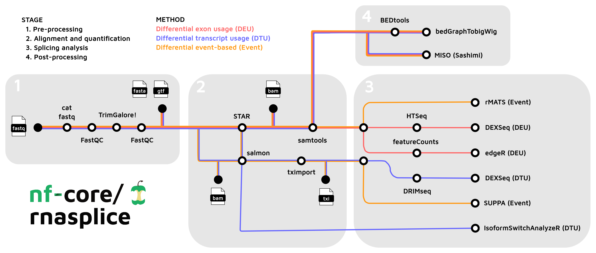

#  

[](https://github.com/nf-core/rnasplice/actions?query=workflow%3A%22nf-core+CI%22)
[](https://github.com/nf-core/rnasplice/actions?query=workflow%3A%22nf-core+linting%22)[](https://nf-co.re/rnasplice/results)[](https://doi.org/10.5281/zenodo.8424632)

[](https://www.nextflow.io/)
[](https://docs.conda.io/en/latest/)
[](https://www.docker.com/)
[](https://sylabs.io/docs/)
[](https://tower.nf/launch?pipeline=https://github.com/nf-core/rnasplice)

[](https://nfcore.slack.com/channels/rnasplice)[](https://twitter.com/nf_core)[](https://mstdn.science/@nf_core)[](https://www.youtube.com/c/nf-core)

## Introduction

**nf-core/rnasplice** is a bioinformatics pipeline for alternative splicing analysis of RNA sequencing data obtained from organisms with a reference genome and annotation.



1. Merge re-sequenced FastQ files ([`cat`](http://www.linfo.org/cat.html))
2. Read QC ([`FastQC`](https://www.bioinformatics.babraham.ac.uk/projects/fastqc/))
3. Adapter and quality trimming ([`TrimGalore`](https://www.bioinformatics.babraham.ac.uk/projects/trim_galore/))
4. Alignment with [`STAR`](https://github.com/alexdobin/STAR)
5. Choice of quantification depending on analysis type:
   1. [`STAR`](https://github.com/alexdobin/STAR) -> [`Salmon`](https://combine-lab.github.io/salmon/)
   2. [`STAR`](https://github.com/alexdobin/STAR) -> [`featureCounts`](https://academic.oup.com/bioinformatics/article/30/7/923/232889?login=false)
   3. [`STAR`](https://github.com/alexdobin/STAR) -> [`HTSeq`](https://htseq.readthedocs.io/en/master/) (DEXSeq count)
6. Sort and index alignments ([`SAMtools`](https://sourceforge.net/projects/samtools/files/samtools/))
7. Create bigWig coverage files ([`BEDTools`](https://github.com/arq5x/bedtools2/), [`bedGraphToBigWig`](http://hgdownload.soe.ucsc.edu/admin/exe/))
8. Pseudo-alignment and quantification ([`Salmon`](https://combine-lab.github.io/salmon/); _optional_)
9. Summarize QC ([`MultiQC`](http://multiqc.info/))
10. Differential Exon Usage (DEU):
    1. [`HTSeq`](https://htseq.readthedocs.io/en/master/) -> [`DEXSeq`](https://bioconductor.org/packages/devel/bioc/vignettes/DEXSeq/inst/doc/DEXSeq.html)
    2. [`featureCounts`](https://academic.oup.com/bioinformatics/article/30/7/923/232889?login=false) -> [`edgeR`](https://bioconductor.org/packages/release/bioc/html/edgeR.html)
    3. Quantification with [`featureCounts`](https://academic.oup.com/bioinformatics/article/30/7/923/232889?login=false) or [`HTSeq`](https://htseq.readthedocs.io/en/master/)
    4. Differential exon usage with [`DEXSeq`](https://bioconductor.org/packages/devel/bioc/vignettes/DEXSeq/inst/doc/DEXSeq.html) or [`edgeR`](https://bioconductor.org/packages/release/bioc/html/edgeR.html)
11. Differential Transcript Usage (DTU):
    1. [`Salmon`](https://combine-lab.github.io/salmon/) -> [`DRIMSeq`](https://bioconductor.org/packages/release/bioc/html/DRIMSeq.html) -> [`DEXSeq`](https://f1000research.com/articles/7-952)
    2. Filtering with [`DRIMSeq`](https://bioconductor.org/packages/release/bioc/html/DRIMSeq.html)
    3. Differential transcript usage with [`DEXSeq`](https://bioconductor.org/packages/devel/bioc/vignettes/DEXSeq/inst/doc/DEXSeq.html)
12. Event-based splicing analysis:
    1. [`STAR`](https://github.com/alexdobin/STAR) -> [`rMATS`](https://github.com/Xinglab/rmats-turbo)
    2. [`Salmon`](https://combine-lab.github.io/salmon/) -> [`SUPPA2`](https://github.com/comprna/SUPPA)

## Usage

:::note
If you are new to Nextflow and nf-core, please refer to [this page](https://nf-co.re/docs/usage/installation) on how
to set-up Nextflow. Make sure to [test your setup](https://nf-co.re/docs/usage/introduction#how-to-run-a-pipeline)
with `-profile test` before running the workflow on actual data.
:::

First, prepare a samplesheet with your input data that looks as follows:

`samplesheet.csv`:

```csv
sample,fastq_1,fastq_2,strandedness,condition
CONTROL_REP1,AEG588A1_S1_L002_R1_001.fastq.gz,AEG588A1_S1_L002_R2_001.fastq.gz,forward,CONTROL
CONTROL_REP1,AEG588A1_S1_L003_R1_001.fastq.gz,AEG588A1_S1_L003_R2_001.fastq.gz,forward,CONTROL
CONTROL_REP1,AEG588A1_S1_L004_R1_001.fastq.gz,AEG588A1_S1_L004_R2_001.fastq.gz,forward,CONTROL
```

Each row represents a fastq file (single-end) or a pair of fastq files (paired end). Rows with the same sample identifier are considered technical replicates and merged automatically. The strandedness refers to the library preparation and should be specified by the user.

:::warning
Please provide pipeline parameters via the CLI or Nextflow `-params-file` option. Custom config files including those
provided by the `-c` Nextflow option can be used to provide any configuration _**except for parameters**_;
see [docs](https://nf-co.re/usage/configuration#custom-configuration-files).
:::

Now, you can run the pipeline using:

```bash
nextflow run nf-core/rnasplice \
   --input samplesheet.csv \
   --contrasts contrastsheet.csv \
   --genome GRCh37 \
   --outdir <OUTDIR> \
   -profile <docker/singularity/.../institute>
```

For more details and further functionality, please refer to the [usage documentation](https://nf-co.re/rnasplice/usage) and the [parameter documentation](https://nf-co.re/rnasplice/parameters).

## Pipeline output

To see the results of an example test run with a full size dataset refer to the [results](https://nf-co.re/rnasplice/results) tab on the nf-core website pipeline page.
For more details about the output files and reports, please refer to the [output documentation](https://nf-co.re/rnasplice/output).

## Online videos

You can find numerous talks on the [nf-core events page](https://nf-co.re/events) from various topics including writing pipelines/modules in Nextflow DSL2, using nf-core tooling, running nf-core pipelines as well as more generic content like contributing to Github. Please check them out!

## Credits

nf-core/rnasplice was originally written by the bioinformatics team from [Zifo RnD Solutions](https://www.zifornd.com/):

- [Benjamin Southgate](https://github.com/bensouthgate)
- [James Ashmore](https://github.com/jma1991)
- [Valentino Ruggieri](https://github.com/valentinoruggieri)
- [Claire Prince](https://github.com/claire-prince)
- [Keerthana Bhaskaran](https://github.com/Keerthana-Bhaskaran-TG)
- [Asma Ali](https://github.com/asmaali98)
- [Lathika Madhan Mohan](https://github.com/lathikaa)

We thank Harshil Patel ([@drpatelh](https://github.com/drpatelh)) and Seqera Labs ([seqeralabs](https://github.com/seqeralabs)) for their assistance in the development of this pipeline.


## Contributions and Support

If you would like to contribute to this pipeline, please see the [contributing guidelines](.github/CONTRIBUTING.md).

For further information or help, don't hesitate to get in touch on the [Slack `#rnasplice` channel](https://nfcore.slack.com/channels/rnasplice) (you can join with [this invite](https://nf-co.re/join/slack)).

## Citations

If you use nf-core/rnasplice for your analysis, please cite it using the following doi: [10.5281/zenodo.8424632](https://doi.org/10.5281/zenodo.8424632)

An extensive list of references for the tools used by the pipeline can be found in the [`CITATIONS.md`](CITATIONS.md) file.

You can cite the `nf-core` publication as follows:

> **The nf-core framework for community-curated bioinformatics pipelines.**
>
> Philip Ewels, Alexander Peltzer, Sven Fillinger, Harshil Patel, Johannes Alneberg, Andreas Wilm, Maxime Ulysse Garcia, Paolo Di Tommaso & Sven Nahnsen.
>
> _Nat Biotechnol._ 2020 Feb 13. doi: [10.1038/s41587-020-0439-x](https://dx.doi.org/10.1038/s41587-020-0439-x).
